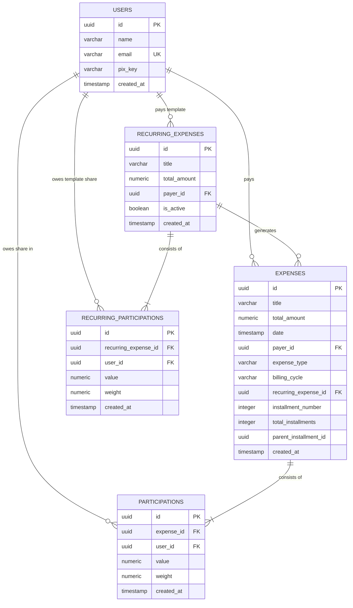

# Family Financial OS - Backend (Module 1)

This project contains the foundational backend service for the **Family Financial OS**, an expense-sharing application. It is built using Python, FastAPI, and SQLAlchemy, designed to run against Supabase (PostgreSQL) in production and an in-memory SQLite database for fast local development and testing.

## Tech Stack & Architecture

- **Backend Framework:** [FastAPI](https://fastapi.tiangolo.com/) for high performance, standard Python type hints, and automated OpenAPI documentation.
- **ORM / Database Model Layer:** [SQLAlchemy 2.0](https://www.sqlalchemy.org/) with eager relationship loading (`lazy="joined"` and `lazy="selectin"`) mapping Users, Expenses, and Participations.
- **Validation Layer:** [Pydantic v2](https://docs.pydantic.dev/) for strict type validation, emails constraint, and custom validator logic.
- **Local Testing:** [pytest](https://docs.pytest.org/) configured with an in-memory SQLite database to run validation tests locally and securely under 1 second.

### Relational Schema



### Share Distribution Logic

When an expense is registered:
1. **Fixed Value Splits:** The backend verifies that the sum of all fixed participant shares matches the `total_amount`.
2. **Weight-based Splits:** If participants specify weights (e.g. 1, 1, 1), the system calculates:
   $$\text{value} = \frac{\text{weight}}{\text{total weight}} \times \text{remaining amount}$$
3. **Rounding Correction:** Rounding differences (e.g. splitting $10.00 among 3 users equally results in $3.33, $3.33, $3.33) are automatically calculated and adjusted (the last participant gets $3.34) so the sum of parts matches `total_amount` to the penny.

---

## Debt Simplification (Module 2)

The application includes an optimized engine to resolve debts within a family or group for any billing cycle (format `YYYY-MM`), minimizing the number of actual transfer transactions required.

### 1. Calculation Flow
1. **Net Balance Calculation**:
   $$\text{Net Balance} = \text{Total Paid} - \text{Total Consumed}$$
   - **Total Paid**: Sum of all expenses registered under the user's ID as the payer.
   - **Total Consumed**: Sum of all participation values assigned to the user across all expenses in that cycle.
2. **Group Classification**:
   - **Creditors**: Users with a net balance $> 0$.
   - **Debtors**: Users with a net balance $< 0$.
3. **Greedy Simplification**:
   - The engine matches the largest debtor (e.g. owing the most) with the largest creditor (owed the most).
   - A transaction is generated: `Debtor owes min(debtor_debt, creditor_credit) to Creditor`.
   - Balances are updated. Any remaining non-zero balance is re-sorted to continue the greedy matching.
   - This iteratively minimizes transaction volume.

### 2. Settlement Endpoint
- **Route**: `GET /api/v1/expenses/settlement`
- **Query Parameter**: `billing_cycle` (format `YYYY-MM`, e.g. `2026-05`)
- **Response Format**:
  ```json
  {
    "billing_cycle": "2026-05",
    "balances": [
      {
        "user_id": "uuid",
        "user_name": "Alice",
        "total_paid": 120.00,
        "total_consumed": 30.00,
        "net_balance": 90.00
      }
    ],
    "transactions": [
      {
        "from_user_id": "uuid",
        "from_user_name": "Bob",
        "to_user_id": "uuid",
        "to_user_name": "Alice",
        "amount": 10.00
      }
    ]
  }
  ```

---

## Recurring Expenses & Installments (Module 3)

The application supports recurring templates for monthly costs and multi-month installment splitting.

### 1. Multi-Month Installments
When an installment expense is created, all $N$ monthly `Expense` rows are generated upfront in the database, linked by a shared `parent_installment_id`.
- **Cross-Month Rounding Correction:** An installment of $100.00 split over 3 months automatically resolves to $33.33 for month 1, $33.33 for month 2, and $33.34 for month 3 to match the total.
- **Participant Rounding Correction:** Participant-level fixed shares are also divided across the months and adjusted on the last month to ensure that the sum of all monthly participation values matches the total share to the penny.
- **Grouped Deletion:** Deleting an installment with the query parameter `delete_group=true` cascadingly deletes all sibling installments in the group.

### 2. Recurring Expenses
Templates represent fixed monthly recurring costs (e.g. Netflix subscription) and generate concrete `Fixed` expenses:
- **API Trigger Endpoint:** `POST /api/v1/recurring-expenses/generate` triggers generation of active templates for a target `billing_cycle`.
- **Idempotency Guarantee:** If the template was already generated for the target billing cycle, it is skipped to avoid double billing.

### 3. CLI Cron Automation
You can run the cron command in a shell to trigger generation:
```bash
# Activate your venv and run:
python backend/app/scripts/generate_recurring.py --billing-cycle YYYY-MM
```

---

## Getting Started

### Local Installation & Environment Setup

These instructions apply to Windows environments using PowerShell/cmd:

1. **Navigate to project directory:**
   ```bash
   cd C:\Users\lucas\.gemini\antigravity\scratch\family-financial-os
   ```

2. **Create and Activate Virtual Environment:**
   ```powershell
   # Create virtual environment
   C:\Python312\python.exe -m venv venv
   
   # Activate virtual environment
   venv\Scripts\Activate.ps1
   ```

3. **Install Dependencies:**
   ```bash
   pip install -r requirements.txt
   ```

---

## Running the Application

To run the local development server (which will automatically initialize tables in SQLite locally):

1. **Navigate to the backend directory:**
   ```bash
   cd backend
   ```

2. **Run the Uvicorn server:**
   ```bash
   uvicorn app.main:app --reload
   ```

Once running, access the interactive API docs at:
- Swagger UI: [http://127.0.0.1:8000/docs](http://127.0.0.1:8000/docs)
- ReDoc: [http://127.0.0.1:8000/redoc](http://127.0.0.1:8000/redoc)

---

## Running the Tests

We use `pytest` for unit and integration testing. Run the tests in the project root:

```bash
# Run all tests
pytest backend/tests/

# Run tests with coverage report
pytest backend/tests/ --cov=backend/app
```

---

## Database Migrations (Supabase)

To apply the database schema to your live Supabase instance:
1. Copy and execute the SQL scripts located in:
   - Initial schema: `supabase/migrations/20260522183500_init_schema.sql`
   - Recurring & Installments update: `supabase/migrations/20260522193000_recurring_and_installments.sql`
2. Open your **Supabase Dashboard** -> **SQL Editor**.
3. Create a new query, paste the scripts sequentially, and click **Run**.
